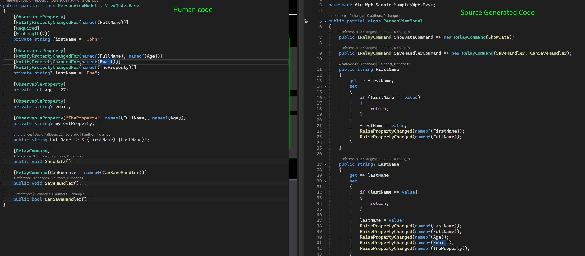

# ATC.Net WPF, WinUI, and Avalonia

This is a base libraries for building WPF, WinUI, or Avalonia application with the MVVM design pattern.

## 📑 Table of Contents

- [Key Features](#-key-features)
  - [MVVM Foundation](#️-mvvm-foundation)
  - [Commands](#-commands)
  - [Messaging System](#-messaging-system)
  - [Behaviors](#-behaviors)
  - [Value Converters](#-value-converters)
  - [Source Generators](#️-source-generators)
  - [Performance Optimizations](#-performance-optimizations)
  - [Utilities](#-utilities)
- [Quick Start](#-quick-start)
- [Requirements](#requirements)
- [NuGet Packages](#nuget-packages-provided-in-this-repository)
- [Documentation](#-documentation)
- [Complete Feature List](#-complete-feature-list)
- [Why Choose Atc.XamlToolkit?](#-why-choose-atcxamltoolkit)
- [How to Contribute](#how-to-contribute)

## 🎁 Key Features

### 🏗️ MVVM Foundation

- **ViewModelBase** - Base class with INotifyPropertyChanged
- **MainWindowViewModelBase** - Main window lifecycle management
- **ViewModelDialogBase** - Dialog-specific ViewModels
- **ObservableObject** - Lightweight observable pattern

### ⚡ Commands

- **RelayCommand** / **`RelayCommand<T>`** - Synchronous commands with `CanExecute` support
- **RelayCommandAsync** / **`RelayCommandAsync<T>`** - Async/await commands for responsive UIs
- **Automatic CanExecute refresh** - Commands automatically update UI state
- **Error handling support** - Built-in `IErrorHandler` interface for graceful error management

### 🔔 Messaging System

Decouple your ViewModels with a powerful messaging infrastructure:

- **Messenger** - Central message bus for app-wide communication
- **GenericMessage&lt;T&gt;** - Send typed messages between components
- **NotificationMessage** - Simple notifications with optional callbacks
- **PropertyChangedMessage&lt;T&gt;** - Broadcast property changes across ViewModels

Perfect for scenarios like:

- Cross-ViewModel communication without direct references
- Event aggregation patterns
- Plugin architectures
- Loosely-coupled component communication

```csharp
// Send a message
Messenger.Default.Send(new GenericMessage<User>(currentUser));

// Receive a message
Messenger.Default.Register<GenericMessage<User>>(this, msg =>
{
    var user = msg.Content;
    // Handle the user...
});
```

Learn more: [Messaging System Documentation](docs/Messaging/Readme.md)

### 🎭 Behaviors

Attach declarative behaviors to UI elements without code-behind. All behaviors work seamlessly across WPF, WinUI, and Avalonia platforms.

#### EventToCommandBehavior

Execute commands in response to any UI event, eliminating the need for code-behind event handlers.

- Works with any routed or standard .NET event
- Optional `CommandParameter` for passing custom data
- `PassEventArgsToCommand` to access event details
- Perfect for maintaining clean MVVM architecture

```xml
<!-- WPF Example -->
<Button Content="Save">
    <i:Interaction.Behaviors>
        <behaviors:EventToCommandBehavior 
            EventName="Click"
            Command="{Binding SaveCommand}" />
    </i:Interaction.Behaviors>
</Button>
```

[Learn more about EventToCommandBehavior](docs/Behaviors/EventToCommandBehavior.md)

#### AnimationBehavior

Provides simple, declarative animations for UI elements without writing animation code.

- **8 animation types**: FadeIn, FadeOut, SlideInFromLeft/Right/Top/Bottom, ScaleIn, ScaleOut
- Trigger-based or auto-start animations
- Customizable duration
- GPU-accelerated for smooth performance

```xml
<Border Background="LightBlue" Padding="20">
    <i:Interaction.Behaviors>
        <behaviors:AnimationBehavior 
            AnimationType="FadeIn"
            Duration="1000"
            AutoStart="True" />
    </i:Interaction.Behaviors>
    <TextBlock Text="I fade in automatically!" />
</Border>
```

[Learn more about AnimationBehavior](docs/Behaviors/AnimationBehavior.md)

#### FocusBehavior

Manages focus for UI elements declaratively through XAML properties.

- **HasInitialFocus** - Set focus when element loads
- **IsFocused** - Two-way bindable focus state
- **SelectAllOnFocus** - Automatically select text in TextBox
- **FocusTrigger** - Trigger focus from ViewModel

```xml
<TextBox Width="300">
    <i:Interaction.Behaviors>
        <behaviors:FocusBehavior 
            IsFocused="{Binding IsFieldFocused, Mode=TwoWay}"
            SelectAllOnFocus="True" />
    </i:Interaction.Behaviors>
</TextBox>
```

[Learn more about FocusBehavior](docs/Behaviors/FocusBehavior.md)

#### KeyboardNavigationBehavior

Enables custom keyboard navigation with arrow keys, Enter, Escape, and Tab through declarative command bindings.

- Arrow key navigation (Up, Down, Left, Right)
- Action keys (Enter, Escape, Tab)
- Enable/disable toggle
- Perfect for grids, lists, and custom controls

```xml
<Border Focusable="True">
    <i:Interaction.Behaviors>
        <behaviors:KeyboardNavigationBehavior
            UpCommand="{Binding NavigateUpCommand}"
            DownCommand="{Binding NavigateDownCommand}"
            LeftCommand="{Binding NavigateLeftCommand}"
            RightCommand="{Binding NavigateRightCommand}"
            EnterCommand="{Binding SelectCommand}" />
    </i:Interaction.Behaviors>
</Border>
```

[Learn more about KeyboardNavigationBehavior](docs/Behaviors/KeyboardNavigationBehavior.md)

**Complete Behaviors Documentation:** [Behaviors Overview](docs/Behaviors/Readme.md)

### 🎨 Value Converters

Extensive collection of ready-to-use XAML converters for WPF, WinUI, and Avalonia:

#### Bool Converters

- `BoolToInverseBoolValueConverter`
- `BoolToVisibilityCollapsedValueConverter`
- `BoolToVisibilityVisibleValueConverter`
- `BoolToWidthValueConverter`
- `MultiBoolToBoolValueConverter` (AND/OR logic)
- `MultiBoolToVisibilityVisibleValueConverter`

#### String Converters

- `StringNullOrEmptyToBoolValueConverter`
- `StringNullOrEmptyToInverseBoolValueConverter`
- `StringNullOrEmptyToVisibilityVisibleValueConverter`
- `StringNullOrEmptyToVisibilityCollapsedValueConverter`
- `ToLowerValueConverter` / `ToUpperValueConverter`

#### Null Converters

- `NullToVisibilityCollapsedValueConverter`
- `NullToVisibilityVisibleValueConverter`

See detailed [Value Converters documentation](docs/ValueConverters/Readme.md)

### ⚙️ Source Generators

Eliminate boilerplate with powerful code generation:

- **[ObservableProperty]** - Auto-generate properties with change notification
- **[ComputedProperty]** - Auto-detect dependencies for computed properties and generate automatic notifications
- **[RelayCommand]** - Auto-generate command properties from methods
- **[ObservableDtoViewModel]** - Auto-generate ViewModel wrappers for DTOs/POCOs with:
  - `IsDirty` tracking for change detection
  - `InnerModel` access to underlying DTO
  - Support for readonly properties
  - Method proxy generation
  - Selective generation with `IgnorePropertyNames` and `IgnoreMethodNames`
  - Automatic validation attribute copying with `EnableValidationOnPropertyChanged` and `EnableValidationOnInit`
  - Support for `[ComputedProperty]` with automatic dependency tracking
- **[DependencyProperty]** (WPF) - Auto-generate dependency properties
- **[AttachedProperty]** (WPF) - Auto-generate attached properties
- **[RoutedEvent]** (WPF) - Auto-generate routed events

Learn more about each generator:

- [SourceGenerators for AttachedProperties](docs/SourceGenerators/AttachedProperty.md)
- [SourceGenerators for DependencyProperties](docs/SourceGenerators/DependencyProperty.md)
- [SourceGenerators for RoutedEvents](docs/SourceGenerators/RoutedEvents.md)
- [SourceGenerators for ViewModel](docs/SourceGenerators/ViewModel.md)

### 🚀 Performance Optimizations

- **BooleanBoxes** - Cached boolean boxing for reduced memory allocations
- **WeakAction/WeakFunc** - Memory-leak prevention for event handlers and callbacks
- **PropertyDefaultValueConstants** - Shared default values for common property types

### 🔧 Utilities

- **DesignModeHelper** - Detect design-time vs runtime for better designer experience
- **Base Converter Classes** - `ValueConverterBase` and `MultiValueConverterBase` for creating custom converters
- **Error Handling** - `IErrorHandler` interface for centralized command error management

## 🚀 Quick Start

### Installation

Install via NuGet Package Manager or .NET CLI:

**For WPF:**

```powershell
dotnet add package Atc.XamlToolkit.Wpf
```

**For WinUI:**

```powershell
dotnet add package Atc.XamlToolkit.WinUI
```

**For Avalonia:**

```powershell
dotnet add package Atc.XamlToolkit.Avalonia
```

### Basic Usage

```csharp
// Create a ViewModel with source-generated properties and commands
public partial class MainViewModel : ViewModelBase
{
    [ObservableProperty]
    private string userName;

    [ObservableProperty]
    private bool isLoading;

    [RelayCommand]
    private async Task LoadDataAsync()
    {
        IsLoading = true;
        // Load data...
        IsLoading = false;
    }
}
```

📖 **[Read the full Getting Started Guide](docs/GettingStarted.md)** for a complete walkthrough.

## Requirements

- [.NET >= 9.0.202 - SDK](https://dotnet.microsoft.com/en-us/download/dotnet/9.0)
- [.NET 9 - Runtime for Avalonia](https://dotnet.microsoft.com/en-us/download/dotnet/9.0)
- [.NET 9 - Desktop Runtime for WPF](https://dotnet.microsoft.com/en-us/download/dotnet/9.0)
- [.NET 9 - Desktop Runtime for WinUI 3](https://dotnet.microsoft.com/en-us/download/dotnet/9.0)

## NuGet Packages Provided in this Repository

| Nuget package                                                                                                                                                                                          | Description                                         | Dependencies                           |
|--------------------------------------------------------------------------------------------------------------------------------------------------------------------------------------------------------|-----------------------------------------------------|----------------------------------------|
| [](https://www.nuget.org/packages/Atc.XamlToolkit)                            | Base package with ViewModelBase, ObservableObject   | Atc & Atc.XamlToolkit.SourceGenerators |
| [](https://www.nuget.org/packages/Atc.XamlToolkit.Wpf)                | RelayCommand, MainWindowViewModelBase for WPF       | Atc.XamlToolkit.SourceGenerators       |
| [](https://www.nuget.org/packages/Atc.XamlToolkit.WinUI)          | RelayCommand, MainWindowViewModelBase for WinUI     | Atc.XamlToolkit                        |
| [](https://www.nuget.org/packages/Atc.XamlToolkit.Avalonia) | RelayCommand, MainWindowViewModelBase for Avalonia  | Atc.XamlToolkit                        |

## 📚 Documentation

### Get Started

- **[Getting Started Guide](docs/GettingStarted.md)** - Complete walkthrough for beginners

### Core Concepts

- [MVVM Framework](docs/Mvvm/Readme.md) - ViewModels, Commands, and MVVM patterns
- [Messaging System](docs/Messaging/Readme.md) - Decoupled communication between components
- [Behaviors](docs/Behaviors/Readme.md) - EventToCommandBehavior and declarative behaviors
- [Source Generators](docs/SourceGenerators/ViewModel.md) - Eliminate boilerplate code

### Advanced Topics

- [Value Converters](docs/ValueConverters/Readme.md) - Complete converter reference
- [Performance Optimizations](docs/Performance/Readme.md) - BooleanBoxes, WeakAction, and more
- [Utilities and Helpers](docs/Utilities/Readme.md) - DesignModeHelper, base classes, and utilities

### Platform-Specific (WPF Only)

- [Dependency Properties](docs/SourceGenerators/DependencyProperty.md) - Auto-generate dependency properties
- [Attached Properties](docs/SourceGenerators/AttachedProperty.md) - Auto-generate attached properties
- [Routed Events](docs/SourceGenerators/RoutedEvents.md) - Auto-generate routed events

### Source Generator Examples

Example for ViewModel classes with source generation:



For more details, see the [MVVM](docs/Mvvm/Readme.md) section.

## 🎯 Complete Feature List

### Core MVVM Components

| Component | Description | Package |
|-----------|-------------|---------|
| `ViewModelBase` | Base ViewModel with INotifyPropertyChanged | Atc.XamlToolkit |
| `MainWindowViewModelBase` | Main window lifecycle management | Atc.XamlToolkit.Wpf/WinUI/Avalonia |
| `ViewModelDialogBase` | Dialog-specific ViewModels | Atc.XamlToolkit |
| `ObservableObject` | Lightweight observable pattern | Atc.XamlToolkit |

### Commands

| Command | Description | Async Support |
|---------|-------------|---------------|
| `RelayCommand` | Synchronous command | No |
| `RelayCommand<T>` | Synchronous command with parameter | No |
| `RelayCommandAsync` | Asynchronous command | Yes |
| `RelayCommandAsync<T>` | Asynchronous command with parameter | Yes |

All commands support:

- ✅ `CanExecute` with automatic refresh
- ✅ Error handling via `IErrorHandler`
- ✅ Auto-generation via `[RelayCommand]` attribute

### Messaging System

| Type | Purpose |
|------|---------|
| `Messenger` | Central message bus |
| `GenericMessage<T>` | Typed message passing |
| `NotificationMessage` | String-based notifications |
| `NotificationMessageAction` | Messages with callbacks |
| `NotificationMessageAction<T>` | Messages with parameterized callbacks |
| `PropertyChangedMessage<T>` | Property change broadcasts |
| `NotificationMessageWithCallback` | Generic callback support |

### Source Generators

| Generator | Platform | Description |
|-----------|----------|-------------|
| `[ObservableProperty]` | WPF, WinUI, Avalonia | Auto-generate observable properties |
| `[ComputedProperty]` | WPF, WinUI, Avalonia | Auto-detect dependencies for computed properties and generate automatic property change notifications |
| `[RelayCommand]` | WPF, WinUI, Avalonia | Auto-generate command properties |
| `[DependencyProperty]` | WPF only | Auto-generate dependency properties |
| `[AttachedProperty]` | WPF only | Auto-generate attached properties |
| `[RoutedEvent]` | WPF only | Auto-generate routed events |
| `[ObservableDtoViewModel]` | WPF, WinUI, Avalonia | Auto-generate DTO wrapper with readonly properties, method proxies, `IgnorePropertyNames/IgnoreMethodNames`, `IsDirty`, `InnerModel`, automatic validation attribute copying, and `[ComputedProperty]` support |

### Value Converters

**Bool Converters** (WPF, WinUI & Avalonia):

- `BoolToInverseBoolValueConverter`
- `BoolToVisibilityCollapsedValueConverter`
- `BoolToVisibilityVisibleValueConverter`
- `BoolToWidthValueConverter`
- `MultiBoolToBoolValueConverter`
- `MultiBoolToVisibilityVisibleValueConverter`

**String Converters** (WPF, WinUI & Avalonia):

- `StringNullOrEmptyToBoolValueConverter`
- `StringNullOrEmptyToInverseBoolValueConverter`
- `StringNullOrEmptyToVisibilityVisibleValueConverter`
- `StringNullOrEmptyToVisibilityCollapsedValueConverter`
- `ToLowerValueConverter`
- `ToUpperValueConverter`

**Null Converters** (WPF, WinUI & Avalonia):

- `NullToVisibilityCollapsedValueConverter`
- `NullToVisibilityVisibleValueConverter`

### Performance Optimizations

| Optimization | Benefit |
|--------------|---------|
| `BooleanBoxes` | Zero-allocation boolean boxing |
| `WeakAction` | Memory leak prevention |
| `WeakFunc<T>` | Memory leak prevention with return values |
| `PropertyDefaultValueConstants` | Shared default values |

### Utilities

| Utility | Purpose |
|---------|---------|
| `DesignModeHelper` | Detect design-time vs runtime |
| `ValueConverterBase` | Base class for custom converters |
| `MultiValueConverterBase` | Base class for multi-value converters |
| `IErrorHandler` | Centralized error handling |

## 🌟 Why Choose Atc.XamlToolkit?

- ✅ **Modern** - Built for .NET 9 with latest C# features
- ✅ **Cross-platform** - Supports WPF, WinUI 3, and Avalonia
- ✅ **High Performance** - Optimized for minimal allocations
- ✅ **Source Generators** - Eliminate boilerplate code
- ✅ **Well Documented** - Comprehensive documentation and examples
- ✅ **Battle Tested** - Used in production applications
- ✅ **Open Source** - MIT licensed and community-driven

## How to contribute

[Contribution Guidelines](https://atc-net.github.io/introduction/about-atc#how-to-contribute)

[Coding Guidelines](https://atc-net.github.io/introduction/about-atc#coding-guidelines)
